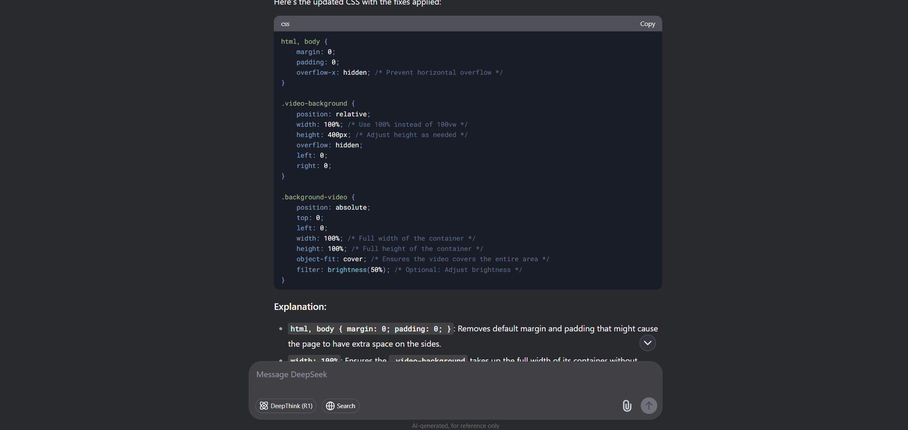
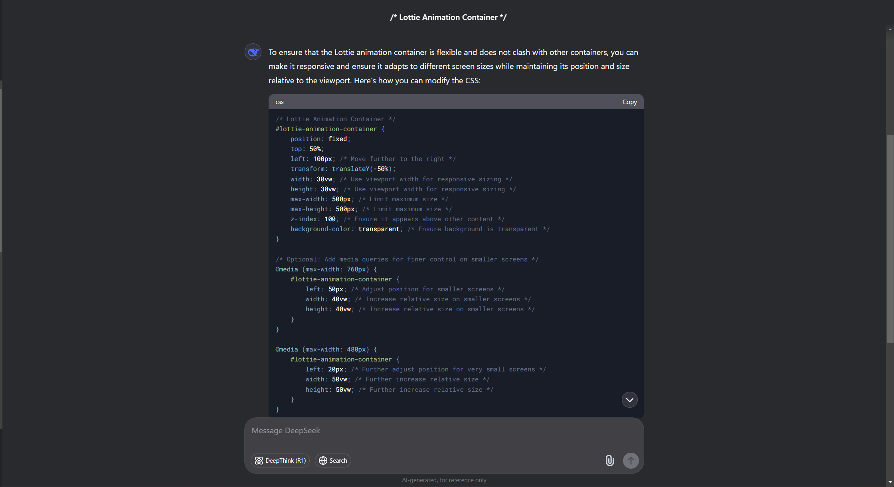
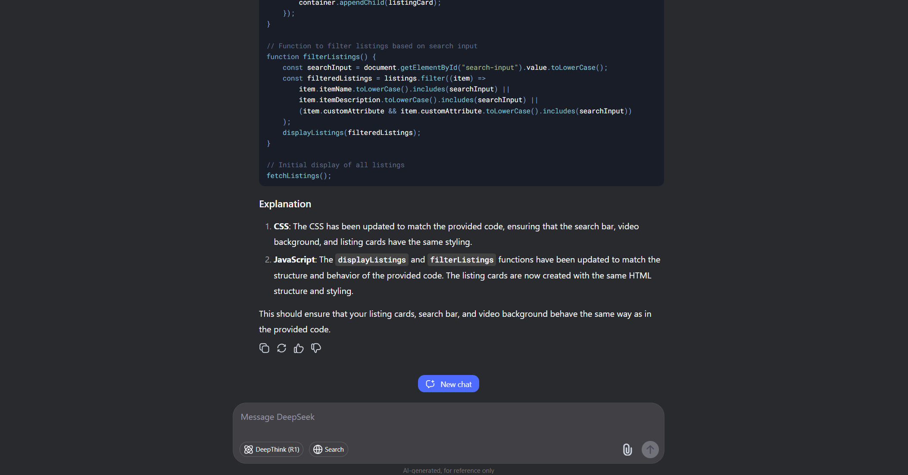
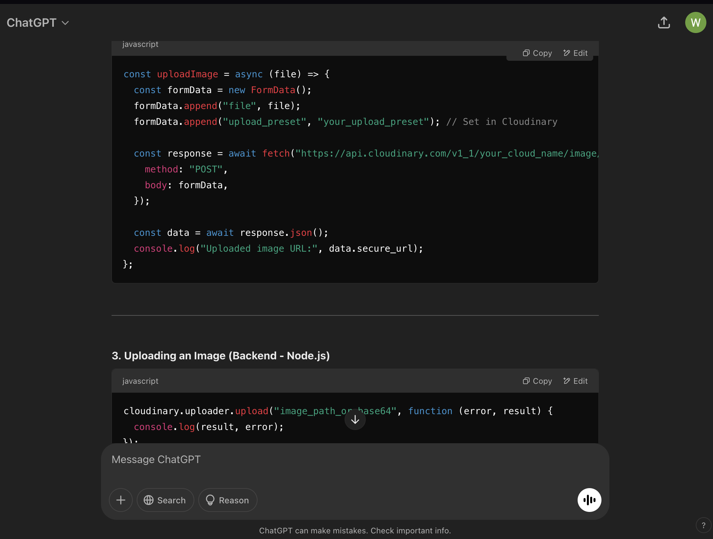
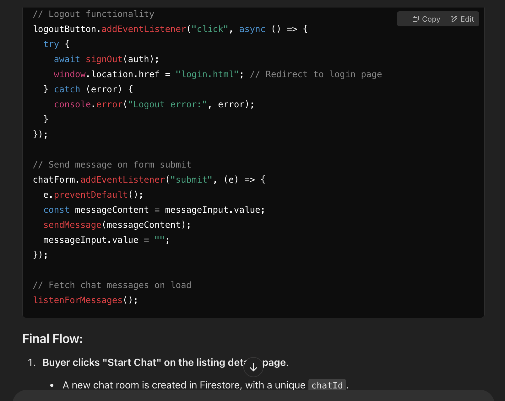

# FED2024Asg2_P04_Team6
This is Bryan Goh's and Teng Ren's FED Assignment

We were looking through the appendix and reading the scenario and realised the app looked really like current apps such as Carousell, Lazada, Shopee. We decided to take some ideas from these applications and combine them together to create the features that we have listed down above. There were some parts of the current available applications that we ourselves do not like and hence we decided to implement our own suggestions into our own MokeSell application. By using our own suggestions that we feel can improve those applications, we used it on our own application to produce a new and improved MokeSell idea that would take the world by storm and hopefully replace the current applications out there. MokeSell uses most of the features of the other applications and combines them together, so users do not need to go to different applications to do different things. We realised that MokeSell resembles Carousell the most which is partially why our idea stems from Carousell. However, instead of copying Carousell main design and their whole features we added our own. As stated, the colour scheme chosen was to allow users to feel comfortable while using the app. Our app has all the default features and new colour design which will make it stand out from others. We decided these features would benefit the app which is why we went for these ideas. 

# Design Process
- Background Videos: We added background videos that fit the theme of the page or the section, allowing the webpages to be more interactive and engaging to the viewers
- Lottie: Lottie is added to the inbox page and profile, making it more engaging and appealing, forcing the user to stay on the website and be more engaged
- Nav-bar to justify drop down: Nav bar when changes to mobile view, nav bar changes to a drop down
- Nav-bar: nav bar gives the current website "active" id making the nav bar yellow, allowing the users to know where they are
- Listing(explore): rows of 3 and column flexing, neat and simple design, form hidden so viewers see the items sold first, buttons on listing different colors to properly differentiate them
- Chat: Each message has a box, allowing them to be displayed and found properly
- Lighter color scheme: Gives website more cheerful vibes, allowing users to feel satistfied while using the website
- Blurred purplish bubbly background in slots: Give website a unique view when after buying so user will not feel bored of the design
- [Figma](https://www.figma.com/design/iOZ4etaJ8i9460aenkGBmJ/FED_Assg2_Wireframe?node-id=0-1&p=f&t=j1GbSMdzsowUIVoa-0)

# Features

## Existing Features
- Login and Sign Up feature by saving user id to firebase api
- Home page (auto scroll with video background), buttons connected to lisitng page
- Explore page (video background), with real-time listings that can be filtered out or categorised. Users can make listings, make an offer, view details of listings, or buy them recorded in firebase API.
- Gamification, where users are able to spin slots to earn points to redeem rewards
- Inbox page, users would be able to view offers made to them (accept or decline), as well as chat messages between potential buyers and themselves(option to delete chat as well).
- Rewards page, displays potential rewards to be won as well as the points system of the slots game.
- Profile page, where account management options(change username, password, or profile picture) as well as a friends system( add friends or accept request, showing a friendlist also), would be displayed
- Mobile view is also used, with the nav bar being able to display a justify icon for dropdown option for smaller screens.

## Features Left to Implement
- Review to sellers
- Real-time chat with staff
- bump listing

# Technology Used

[Firebase](https://firebase.google.com)
Firebase is an excellent for the implementation of API and storing and retrieving in and from the cloud database

[Cloudinary](https://cloudinary.com)
Cloudinary is an excellent tool for storing images in the cloud and retrieving to the firebase database, since firebase storage has become a paid feature, this is an excellent alternative to achieve the outcomes of the website

CSS
CSS is an amazing coding langauge that has a great deal of flexibility in designing websites to however the user wants it to be

Javascript
Javascript is another excellent coding language to implement the unique and different front end features to make websites coded seem like they have backend features, despite it being only in the front end, an excellent language for those who has just started with front end development

HTML
HTML is the perfect language for this project as it is able to seemlessly connect the design features of the CSS and the website extra functionalities of the javascript, allowing a functional website to be built without any backend technologies like node.js

[Youtube to Webp comverter](https://en4.onlinevideoconverter.pro/45uu/youtube-downloader-mp4)
This website is an excellent website for converting our videos to webp, allowing our website to seem more realistic due to the videos previewing in the background

ChatGPT/DeepSeek
ChatGPT/DeepSeek is a strong artificial intelligence tool to help debug and teach me how to use the api features, allowing me to implement my features and even explore new features that I thought I could not do

# Assistive AI

- Video background: Used DeepSeek to debug error in listing page where video does not cover both ends of the page

- Lottie Container mobile view: used Deepseek to debug flex error in lottie container

- Search and filtered listing: Ensured that its mobile view is displayed correctly, as well as ensuring that the search functionality works when all letters are lower-case

- Learnt how to use and set up cloundinary for image upload and retrieval

- Debugged chat feature with chatgpt

# Testing
Login Page (index.html)
- Can only login if account is already created
- Can only login if password is filled and is correct(matching when the account is created)
- Try to do anything that does not fit the criteria, error will popup and remind you to fill them up

Sign Up Page (signuppage.html)
- Can sign up if all fields are filled (password and confirm password field must be same)
- Password must be at least 6 characters long
- Email must be @gmail.com
- Try to do anything that does not fit the criteria, error will popup and remind you to fill them up

Home Page (home.html)
- Can scroll the 5 pages of mp4 videos which gives the preview oh how each category can contain
- Has header/nav bar which can enter the Explore page (listing), Inbox page (has chat feature and price request), Rewards Page that shows what you can earn and profile page to add friends and change your own details

Explore Page (listing.html)
- Has a button which can create listing(unhide form)
- Button to close the form
- All fields must be filled in so that they can post the listing
- If all fields are not filled, listing cannot be created and error will popup reminding you to fill them up
- There are search bars and filters 
- Lisitings displayed are displayed in a row of 3 and goes down a column if a fourth one appears and the same process repeats
- Each listings have the name of their listing, their condition, the price, the category, the views, the description and listed by who
- Each listing has 3 buttons to buy, make an offer and finally view more details
- When you make an offer, the offer would be sent to the inbox of the seller(lister)
- When you buy, you are brought to a page where you can spin 5 times and after spinning, the points will be saved and you can spend them to buy one reward, after buying, you will be brought back to the listing page. Listing would be deleted when bought.
- When you click view details, it stores your views in the listing page of each listing, and since if the listing is clicked, it means the buyer is interested, allowing them to start a private chat with the seller, the chat room is private, messages are saved to ensure to fraud is commited and buyers and sellers have a log to check

Inbox Page (inbox.html)
- At the side bar has 2 features
- First feature is the acceptance of offer or the decline of the offer
- Upon acceptance, price will change, and upon decline, nothing will happen and the offer will dissapear if either options are pressed
- When clicking on the chats button, display list of users the current user is chatting with(the ones who click chat with buyer in the listing details), only sellers can access this
- Upon clicking on who to chat with you are brought to the same page but the inbox lottie is replaced with the chat where you can chat with the buyer
- You can also delete the chat but the chat logs will be saved for fraud prevention

Rewards Page (rewards.html)
- Displays the chances of the game that can be played after purchasing something in the explore page
- Displays the possible rewards that can be earned from playing the slots

Profile Page (profile.html)
- Allows you to change your username
- Add or remove a profile picture
- Change passwords but must still be at least 6 characters long
- Search for friends, if name not in firestore database, name would not appear and say no user found
- If user found can add friend as friend
- The person that got requested can accept or deny the friend request
- If friend gets accepted, added to the friendlist which is displayed below

Flex
- Most of our flex are horizontal
- Flex for nav bar changes it to the justify icon which can be pressed and created into a drop down

# Credits

## Content
[Lottie](https://app.lottiefiles.com/animation/ddb0f21b-9b13-413d-9e9b-1498002adafb?channel=web&source=public-animation&panel=download)

[Formatting of ReadMe](https://github.com/DonovanKoh/interactivedev-readme-template?tab=readme-ov-file#media)

[Fashion video](https://www.youtube.com/watch?v=t2LMvk7CKJ0)

[Electronics video](https://www.youtube.com/watch?v=oYmU8Av_e84)

[Kitchenware Video](https://www.youtube.com/watch?v=XJiyfQjgzjs)

[Furniture Video](https://www.youtube.com/watch?v=kkiJftHG3Wo)

[Sports Video](https://www.youtube.com/watch?v=r8AeU9z_MUI)

[Listing video](https://www.youtube.com/watch?v=IwNlGi_fQCk)

## Image
[Listing photo](https://www.freepik.com/free-photo/bags-with-gifts-top-copy-space_5496689.htm#fromView=keyword&page=1&position=25&uuid=b0f609a4-1923-411b-8ac9-429179ab6c74&query=E+Commerce+Background)

[Background1](https://www.freepik.com/free-photo/3d-illustration-laptop-with-shopping-basket-paper-bags-online-shopping-e-commerce-concept_12955270.htm#fromView=keyword&page=1&position=17&uuid=16097991-e4b5-4dd3-ac22-bfc7c2c66568&query=E+Commerce+Background)

[Background 2](https://www.freepik.com/free-psd/3d-rendering-ecommerce-background_165591316.htm#fromView=keyword&page=1&position=42&uuid=16097991-e4b5-4dd3-ac22-bfc7c2c66568&query=E+Commerce+Background)

[Background 3](https://www.freepik.com/free-photo/3d-illustration-smartphone-with-products-coming-out-screen-online-shopping-e-commerce-concept_12740329.htm#fromView=keyword&page=1&position=3&uuid=16097991-e4b5-4dd3-ac22-bfc7c2c66568&query=E+Commerce+Background)

[Kia-car](https://www.google.com/search?q=car+4k+hd+photo+kia&sca_esv=4271166684a7579e&rlz=1C1FKPE_en-GBSG1101SG1101&udm=2&biw=2048&bih=983&sxsrf=AHTn8zrDs74HqV2CRn-pV1XVQwf0dGgPwg%3A1738959389746&ei=HWqmZ6ukLZSt4-EPgfCeoAY&ved=0ahUKEwjrptHFsLKLAxWU1jgGHQG4B2QQ4dUDCBE&uact=5&oq=car+4k+hd+photo+kia&gs_lp=EgNpbWciE2NhciA0ayBoZCBwaG90byBraWEyBhAAGAgYHkj7CVCCBVj-CHABeACQAQCYAS-gAZYBqgEBNLgBA8gBAPgBAZgCA6ACYJgDAIgGAZIHATOgB-sF&sclient=img#vhid=P6ZjHt0Cfyj_kM&vssid=mosaic)

[Washing Machine](https://www.google.com/search?q=washing+machine+4k+hd+expensive&sca_esv=4271166684a7579e&rlz=1C1FKPE_en-GBSG1101SG1101&udm=2&biw=2048&bih=983&sxsrf=AHTn8zrd8TLZHHNxPFCiyZI-RKUQGtwXXA%3A1738960046677&ei=rmymZ5yFKc3t4-EPxYec2AE&ved=0ahUKEwiclPH-srKLAxXN9jgGHcUDBxsQ4dUDCBE&uact=5&oq=washing+machine+4k+hd+expensive&gs_lp=EgNpbWciH3dhc2hpbmcgbWFjaGluZSA0ayBoZCBleHBlbnNpdmVInxdQugRYjBZwAXgAkAEAmAE2oAH7AqoBAjEwuAEDyAEA-AEBmAIAoAIAmAMAiAYBkgcAoAfCAw&sclient=img#vhid=b6oxYNIKkIIdQM&vssid=mosaic)

[Macbook](https://www.google.com/search?sca_esv=4271166684a7579e&rlz=1C1FKPE_en-GBSG1101SG1101&sxsrf=AHTn8zq5vi6tOoXunmd3xpKmMVanDPsF1Q:1738960109757&q=macbook+4k+hd+photo&udm=2&fbs=ABzOT_CWdhQLP1FcmU5B0fn3xuWpA-dk4wpBWOGsoR7DG5zJBpwxALD7bRaeOIZxqOFEngzB_O_LYSS4XXpaWwzVPCpGyfWZJNZM94YXT9YDYyu8sXSqhrL12HIXDrJcXcBPVxMprVBzBBo8GpBTOKii_ARewHE9whuTvgqKpWOQ3jE_MfDjmcaUNU5MpOa63pWd-S9AtQjUEKe-W7V3qjyZPFG2EsavEg&sa=X&ved=2ahUKEwiloPucs7KLAxXb4zgGHUqLHTsQtKgLegQIEBAB&biw=2048&bih=983&dpr=1.25#vhid=pegJzCel5opsCM&vssid=mosaic)

[Iphone 16](https://www.google.com/search?q=iphone16+4k+hd+photo&sca_esv=4271166684a7579e&rlz=1C1FKPE_en-GBSG1101SG1101&udm=2&biw=2048&bih=983&sxsrf=AHTn8zpzLyhSFv76XDCV-oyBNX0XirAblA%3A1738960110914&ei=7mymZ-jGN8-q4-EPpPnHkAU&ved=0ahUKEwjo9cGds7KLAxVP1TgGHaT8EVIQ4dUDCBE&uact=5&oq=iphone16+4k+hd+photo&gs_lp=EgNpbWciFGlwaG9uZTE2IDRrIGhkIHBob3RvSNg3UPQdWIExcAN4AJABAJgBMKAB1wKqAQE5uAEDyAEA-AEBmAIGoALyAcICBhAAGAcYHsICCBAAGAcYCBgemAMAiAYBkgcBNqAHkDk&sclient=img#vhid=BDpkd9epRvPwFM&vssid=mosaic)

[Giftcard](https://www.google.com/search?q=100+dollar+singapore+money+4k+hd+photo+high+quality&sca_esv=4271166684a7579e&rlz=1C1FKPE_en-GBSG1101SG1101&udm=2&biw=2048&bih=983&sxsrf=AHTn8zotAg8OdkHz_Z8QlZWTQ0mXX5l2qQ%3A1738960242563&ei=cm2mZ86PIq_H4-EP5Oih0As&ved=0ahUKEwjOkKXcs7KLAxWv4zgGHWR0CLoQ4dUDCBE&uact=5&oq=100+dollar+singapore+money+4k+hd+photo+high+quality&gs_lp=EgNpbWciMzEwMCBkb2xsYXIgc2luZ2Fwb3JlIG1vbmV5IDRrIGhkIHBob3RvIGhpZ2ggcXVhbGl0eUidJVAAWNIjcAB4AJABAJgBKaAB7waqAQIyNrgBA8gBAPgBAZgCAKACAJgDAJIHAKAHkgk&sclient=img#vhid=kFI4kkVxOv7WTM&vssid=mosaic)

[Wireless earbuds](https://www.google.com/search?q=wireless+earbuds+4k+hd+photo+high+quality&sca_esv=4271166684a7579e&rlz=1C1FKPE_en-GBSG1101SG1101&udm=2&biw=2048&bih=983&sxsrf=AHTn8zqxIeYbEPGNhApxH4H0_oWwKMVoKQ%3A1738960263677&ei=h22mZ-aIKfaIqfkP8M-buQE&ved=0ahUKEwim6K3ms7KLAxV2RCoJHfDnJhcQ4dUDCBE&uact=5&oq=wireless+earbuds+4k+hd+photo+high+quality&gs_lp=EgNpbWciKXdpcmVsZXNzIGVhcmJ1ZHMgNGsgaGQgcGhvdG8gaGlnaCBxdWFsaXR5SKARUABYzxBwAHgAkAEAmAEpoAGnBKoBAjE2uAEDyAEA-AEBmAIAoAIAmAMAkgcAoAfQBQ&sclient=img#vhid=VLv16Gr3kA1aqM&vssid=mosaic)

[Waterbottle](https://www.google.com/search?q=hydroflask+4k+hd+photo+high+quality&sca_esv=4271166684a7579e&rlz=1C1FKPE_en-GBSG1101SG1101&udm=2&biw=2048&bih=983&sxsrf=AHTn8zqb9pTODskzSkky2vhPD9RbeqPz9g%3A1738960364747&ei=7G2mZ-qsLdqY4-EPiJXjUA&ved=0ahUKEwjq0saWtLKLAxVazDgGHYjKGAoQ4dUDCBE&uact=5&oq=hydroflask+4k+hd+photo+high+quality&gs_lp=EgNpbWciI2h5ZHJvZmxhc2sgNGsgaGQgcGhvdG8gaGlnaCBxdWFsaXR5SO0uUIEEWIItcAZ4AJABAZgBcqAB6QeqAQQyNi4xuAEDyAEA-AEBmAIAoAIAmAMAiAYBkgcAoAe_CQ&sclient=img#vhid=2J1RsoEk99j-0M&vssid=mosaic)

[Mystery bag](https://www.google.com/search?q=mystery+bag+hd+photo+high+quality&sca_esv=4271166684a7579e&rlz=1C1FKPE_en-GBSG1101SG1101&udm=2&biw=2048&bih=983&sxsrf=AHTn8zoUMsDec0BUJx5mLFApIlReE2zfjQ%3A1738960413513&ei=HW6mZ4CKH6GF4-EP-I-ayAo&ved=0ahUKEwjAjOettLKLAxWhwjgGHfiHBqkQ4dUDCBE&uact=5&oq=mystery+bag+hd+photo+high+quality&gs_lp=EgNpbWciIW15c3RlcnkgYmFnIGhkIHBob3RvIGhpZ2ggcXVhbGl0eUjoEVDJBVj8D3ABeACQAQCYASagAaYBqgEBNbgBA8gBAPgBAZgCAKACAJgDAIgGAZIHAKAH4QE&sclient=img#vhid=1gqxZ2-3xK3NdM&vssid=mosaic)

[Tote bag](https://www.google.com/search?q=totebag+hd+photo+high+quality&sca_esv=4271166684a7579e&rlz=1C1FKPE_en-GBSG1101SG1101&udm=2&biw=2048&bih=983&sxsrf=AHTn8zp3SBNXVdUaeXH0xShgS7K02owJ_A%3A1738960421426&ei=JW6mZ57iGeaL4-EPiuzp2AY&ved=0ahUKEwjeiMqxtLKLAxXmxTgGHQp2GmsQ4dUDCBE&uact=5&oq=totebag+hd+photo+high+quality&gs_lp=EgNpbWciHXRvdGViYWcgaGQgcGhvdG8gaGlnaCBxdWFsaXR5SNIMUABY-ghwAHgAkAEAmAFIoAGjAqoBATe4AQPIAQD4AQGYAgCgAgCYAwCSBwCgB7sC&sclient=img#vhid=NDE6st7vhUVUKM&vssid=mosaic)

# Acknowledgements
- Used Coach homepage as inspiration for video background for homepage
[Coach Homepage](https://singapore.coach.com/)
- Used youtube video as inspiration for slots game
[slots game](https://www.youtube.com/watch?v=PiLGravLedY)
- Learnt how to use firebase from this youtube channel
[Firebase tutorial](https://www.youtube.com/@programmingarc)
